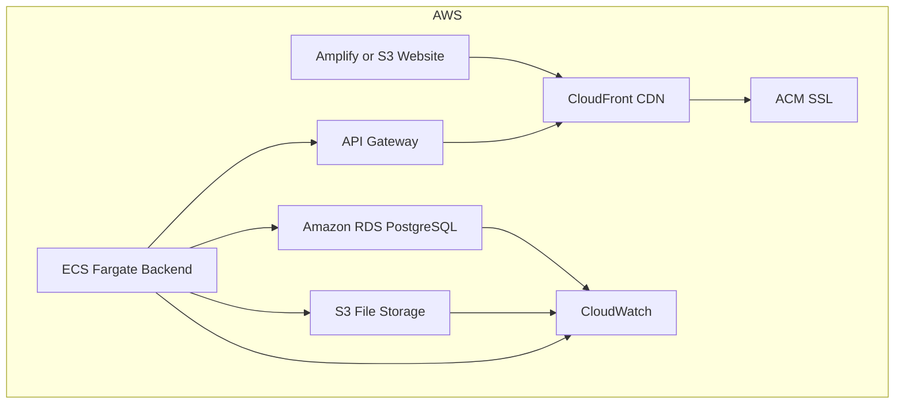

# CloudGo.ai AWS Migration – Terraform Infrastructure

## Overview
This project migrates the CloudGo.ai full-stack infrastructure from Supabase to AWS using Terraform. It provisions a robust, scalable, and secure AWS environment for a PostgreSQL database, frontend web hosting, backend containerized services, file storage, and monitoring. The architecture is modular, environment-agnostic, and follows AWS/Terraform best practices.

## Architecture Diagram


## Features
- **Networking:** VPC with public/private subnets, NAT, flow logs, and security groups
- **Database:** RDS PostgreSQL (Multi-AZ, encrypted, IAM, backups, PITR)
- **Frontend:** AWS Amplify (or S3), CloudFront CDN, ACM for HTTPS
- **Backend:** ECS Fargate, ALB, API Gateway, autoscaling
- **File Storage:** S3 with versioning, lifecycle, encryption, and access controls
- **Monitoring:** CloudWatch logs, alarms, log streaming to S3, SNS notifications
- **Security:** IAM least privilege, encryption at rest/in transit, private networking

## Getting Started
1. **Clone the repo:**
   ```sh
   git clone <this-repo>
   cd <this-repo>
   ```
2. **Edit `terraform.tfvars`:**
   - Fill in AWS region, VPC/subnet CIDRs, DB credentials, repo URLs, domain, and any other required variables.
   - Example:
     ```hcl
     aws_region = "us-west-2"
     db_password = "YOUR_SECURE_PASSWORD"
     # ...
     ```
3. **Initialize Terraform:**
   ```sh
   terraform init
   ```
4. **Plan and Apply:**
   ```sh
   terraform plan
   terraform apply
   ```

## Modifying the Project
- **Modules:** All major AWS components are modularized under `modules/`. Edit or extend as needed.
- **Variables:** Add/change variables in `variables.tf` and `terraform.tfvars`.
- **Outputs:** Key outputs (endpoints, ARNs, etc.) are surfaced in `outputs.tf`.

## Notes
- **Sensitive values:** Never commit secrets (like DB passwords) to version control.
- **State backend:** S3/DynamoDB backend is parameterized for multi-env support.
- **Errors:** If you encounter errors, use `terraform validate` and check module/variable wiring.

## Next Steps
- Edit `terraform.tfvars` with your actual values.
- Run `terraform validate` to check for errors.
- Review/extend modules for your specific needs (e.g., advanced monitoring, WAF, DMS migration).

---

**CloudGo.ai AWS Migration – Automated, repeatable, and secure cloud infrastructure.**
